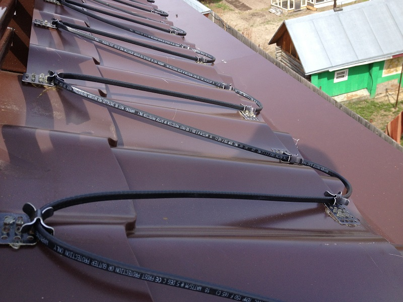
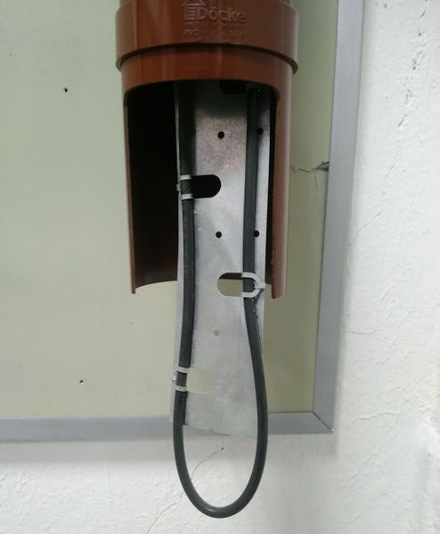

# Крыша

## Принудительное снеготаяние

Укрепляется обычный провод, который подключается через мощный трансформатор.
Крепежный элемент типа KBI-RC-ST крепится на лист с помощью эмфимастики.

Монтажная лента двойная тип KBI-DUAL-ST не дает закрутиться внутри водостока

Греющий кабель для обогрева кровли и водостоков резистивный SPYHEAT MFD-30 может неплохо подойти.
Параллельное соединение даст возможность питать его безопасным напряжением от трансформатора.

[podogrev.xlsx](podogrev.xlsx)