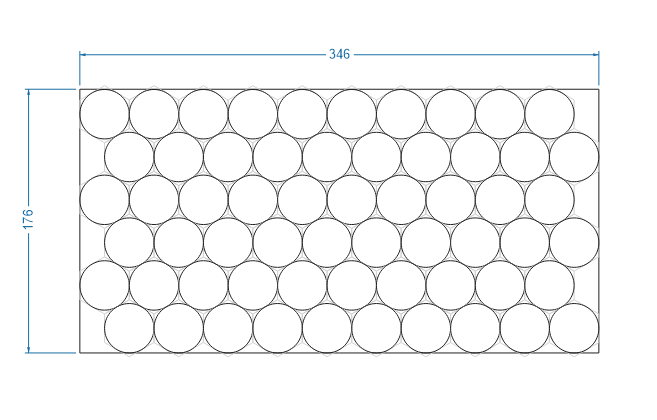
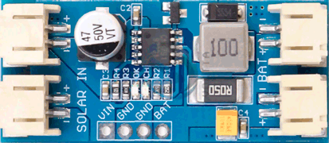

# Электромоторы

## Аккумуляторы

Без вариантов только LiFePO4, как самые неприхотливые, пусть несколько более тяжелые чем Li-Ion,
к расчету относительного веса:

| Тип           | Вес | Напряжение | Емкость А*ч | Емкость Вт*ч | Вес Вт*ч |
|---------------|-----|------------|-------------|--------------|----------|
| Li-Ion 18650  | 50  | 3,75       | 2,5         | 9,375        | 5,3      |
| LiFePO4 32650 | 140 | 3,3        | 6           | 19,8         | 7,1      |

Массу одной батареи не следует делать более 10 кг.  
Поэтому оптимально будет 6sх10p весом 8,4 кг  
Емкость составит 1188 Вт*ч

## Для пеших походов

Заряжаем один LiIon элемент. Даже в пасмурную погоду можно получить около 2-х ватт.

| Параметр                  |                | 
|---------------------------|----------------|
| Мощность элемента, макс   | 1,6 Вт         |
| Напряжение элемента, макс | 0,67 В         |
| Напряжение элемента, раб  | 0,4 - 0,54 В   | 
| Мощность панели 16 шт     | 2,56 - 25,6 Вт |
| Напряжение панели, раб    | 6,4 - 8,64 В   | 
| Напряжение панели, макс   | 10,72          |

MPPT контроллер на базе cn3791 [dse-cn3791.pdf](solar/dse-cn3791.pdf)

### BMS

Неплохой с низким [сопротивлением](https://aliexpress.ru/item/1005004901655940.html) 0,7 мОм.
При токе 20 А (400 Вт) потери составят 14 мВ или 0,28 Вт

  
Подробнее

