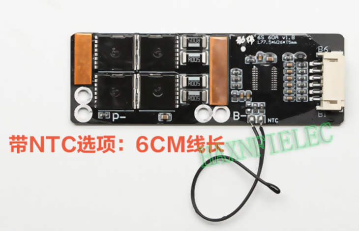
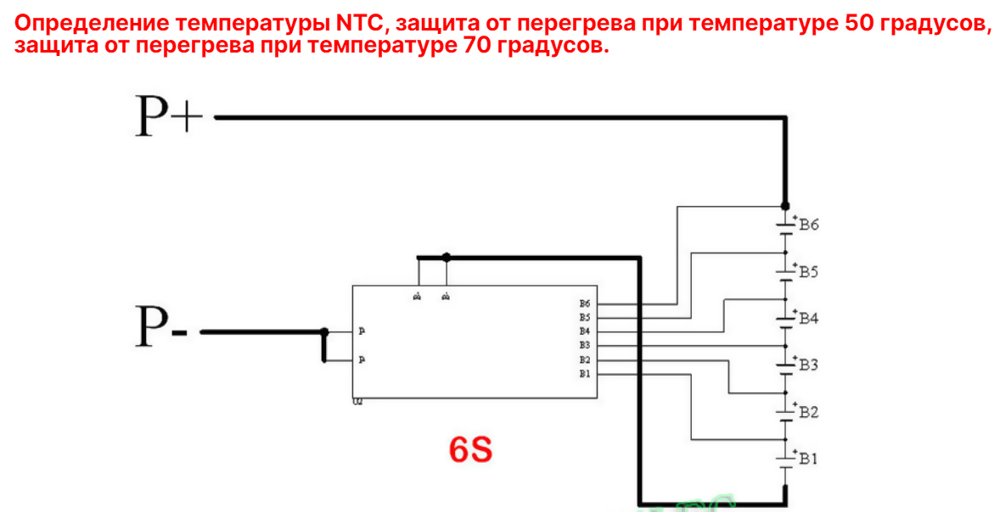

# Электромоторы

## Аккумуляторы

Без вариантов только LiFePO4, как самые неприхотливые, пусть несколько более тяжелые чем Li-Ion

к расчету веса

| Тип           | Вес | Напряжение | Емкость Ач | Емкость Втч | Вес Втч |
|---------------|-----|------------|------------|-------------|---------|
| Li-Ion 18650  | 50  | 3,75       | 2,5        | 9,375       | 5,3     |
| LiFePO4 32650 | 140 | 3,3        | 6          | 19,8        | 7,1     |

### BMS

Неплохой с низким [сопротивлением](https://aliexpress.ru/item/1005004901655940.html) 0,7 мОм.
При токе 20 А (400 Вт) потери составят 14 мВ или 0,28 Вт

  
Подробнее

