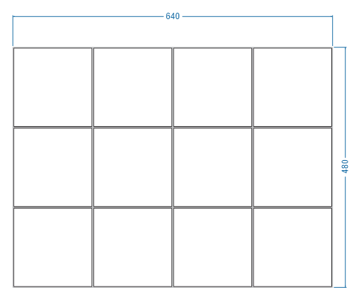
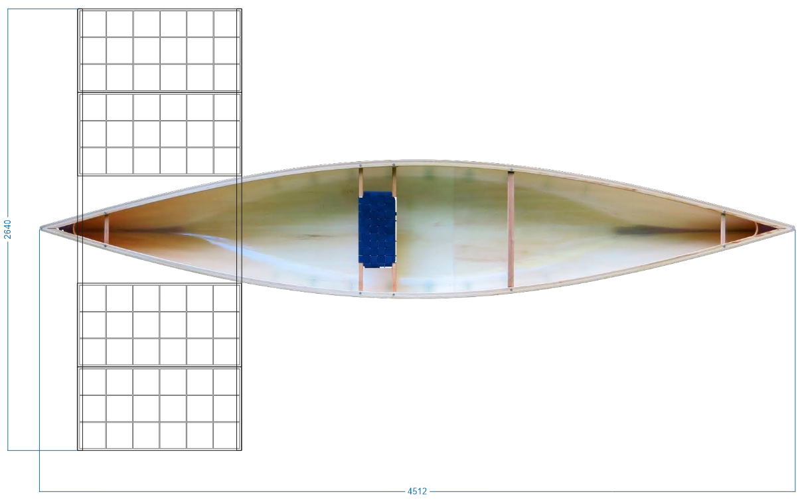

# Солнечные батареи

В среднем напряжение на одном элементе от 0,4 до 0,5 В  
Максимальное 0,65 В, вот на него должен быть рассчитан преобразователь.

Допустим, применяем 6 панелей с 12 элементами на каждой  
имеем в минимуме 72*0,4 = 28,8 В, в максимуме 46,8 В

| Освещение, Вт/м2 | Мощность одного элемента | Мощность батареи |
|------------------|-----------------------------|---------------------|
| 1000             | 5,28                        | 380                 |
| 500              | 2,64                        | 190                 |
| 200              | 1,06                        | 76                  |
| 100              | 0,53                        | 38                  |

Даже в пасмурную погоду имеем неплохую мощность.

Так можно разместить на каное

